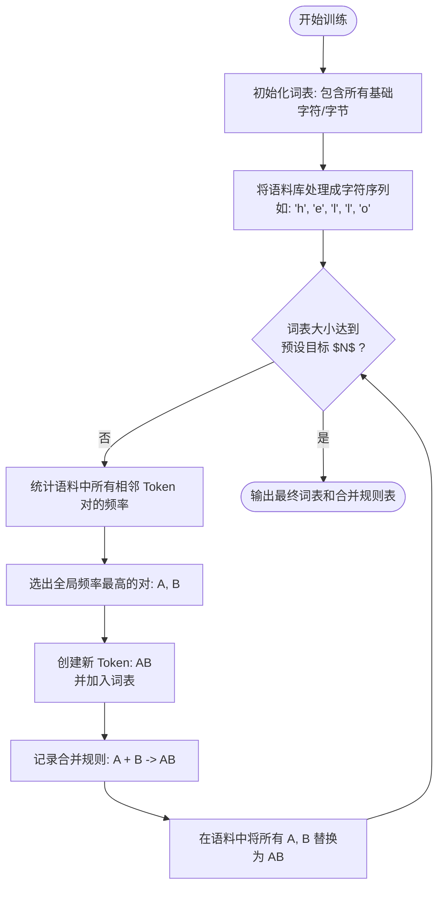

# CS336 Notes

## Part I

### BPE Tokenizer:



### Einsum

```python
torch.einsum('bik, bjk -> bik', A, B)
```

即将向量$A(B\times I\times K)$与向量$B(B\times J\times K)$计算出$(B\times I\times K)$的结果


### Einops Reduce

```python
y = reduce(A, '... hidden -> ...')
```

即将向量$A(...\times A\times N)$的最后一维全部求和后降维成$A(...\times A)$


### Einops Rearrange

```python
y = rearrange(A, '... (hidden1, hidden2) -> ... hidden1, hidden2', hidden1 = 2)
```

将向量的最后一维展开成两维，即变成hidden1和hidden2两维


### Computational FLOPs

一般而言，训练模型的FLOPs为

$$前向传播：2\times DataPoints \times Parameters \\ 反向传播：4\times DataPoints \times Parameters\\ 总共成本：6\times DataPoints \times Parameters$$


### Initialization

```python
nn.Parameter(torch.randn(input.dim, hidden.dim) / np.sqrt(input.dim))
```

这里需要注意，虽然`randn()`会将Parameter初始化为方差为1，均值为0的正态分布，但是在Parameter乘上Input之后，Output的方差将会变为$$Var(Output) = Input.dim~\times~Var(Input)\times~Var(Para)$$，故需要除以sqrt(input dim)保证Input标准差等同于Output

**这个叫Xavier随机分布**


### Transformer Residual Arrangment

原则是尽量让残差传播路线足够简单，以保证残差信息更好的传播；因此此处可以引出将Norm（归一化操作）前置，挪出残差路径


### LayerNorm vs RMSNorm

$$
LayerNorm = \dfrac{x-E(x)}{\sqrt{Var(x)+\epsilon}}\gamma+\beta\\
RMSNorm = \dfrac{x}{\sqrt{||x||^2+\epsilon}}\gamma
$$

- RMSNorm计算量更小，不用算均值，减少了内存移动以加速计算
- RMSNorm取消了偏置项，因为偏置项会影响训练的稳定性，且最终效果与无偏置项区别不大
- btw，现代Transformer大多抛弃了FFN和Attention层的偏置


### *GLU

各类门控激活函数的实现原理类似（如ReGLU=ReLU + Gate）
$$
ReGLU = (GeLU(xW_1) \otimes xV)
$$
其中，GeLU(xW)称为门控分支，xV称为线性分支

- btw，$SwiGLU=Swish+GLU,~Swish=x\cdot sigmoid(x)$


### RoPE

对Q，K向量，两两向量结合，然后做下述计算：
$$
\begin{pmatrix}
cosm\theta_i & -sinm\theta_i \\
sinm\theta_i & cosm\theta_i
\end{pmatrix}
\times
\begin{pmatrix}
(q~or~k)_{2i} \\
(q~or~k)_{2i + 1} 
\end{pmatrix}
$$

- 如何理解/记忆？
  - 就当是$(0,1),(1,0)$的单位向量逆时针旋转了$\theta$度，得到的$(-sin\theta, cos\theta)(cos\theta,sin\theta)$反过来就是

RoPE里的$m,\theta_i$是固定且预先定义已知的，不学习


### Weight Decay

引入Weight Decay其实很玄学的不是为了防止过拟合（因为大多数只训练1 epoch），而是因为能够**带来更好的loss表现**


### Optimize Softmaxes

#### Output Softmax

对于输出时的Softmax，优化方式是引入`z-loss`
$$
log(Softmax(P)) = log(\dfrac{e^i}{\sum e^{all}})\\
Loss = \sum[log(Softmax(P)) - \alpha z^2]\\
z = \sum e^{all} - 0
$$

#### In-Transformer Softmax

对于Transformer内部的（Attention后）Softmax，考虑直接在算出Q，K后分别对二者进行Layer Norm归一，然后在相乘，送进Softmax


### MHA, MQA, GQA

与训练不同，全量的MHA的计算强度(Arithmetic Intensity)是很低的，因为并行性低（一次只输入一个Token）**且高强度访存（每多一个Token就要多存一列Key和一行Value，然后访问之前所有存好的Key和Value做计算，即KV Cache）**，于是头痛医头，我们想办法减少K和V就能减少访存，增加计算强度，于是引入了：

#### MQA - Multi Query Attention

只保留Query的多头，Key和Value均只保留$d_{head}$维，每个Query Head去乘的Key和Value都是留下的那几维

#### GQA - Group Query Attention

保留Query的多头，同时Key和Value保留Group个头，每几个Query对应1个Key和1个Value去乘，作为一个Group


### Sparse Attention

稀疏注意力就是，滑动式的只注意自己往前k个词（SWA），这样能将原先$n^2$的复杂度降到n